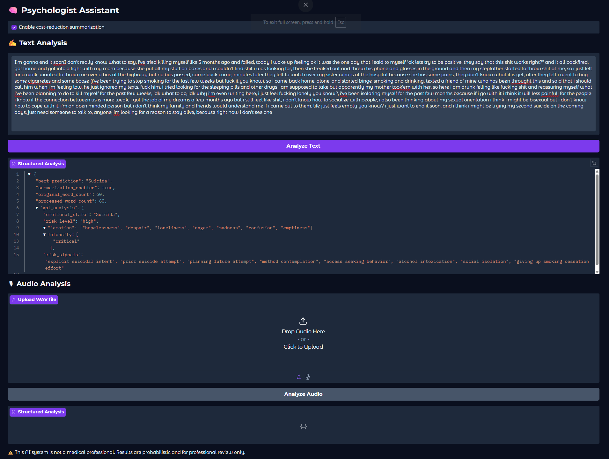

# 🧠 Psychologist Assistant  
AI-Based NLP System for Clinical Conversation Analysis  

---

## 📌 Overview

**Psychologist Assistant** is an NLP-based system designed to process and analyze psychotherapy session segments using a multi-layer AI architecture.

The system supports both **text and audio input**, performs structured psychological signal extraction, and generates analytical JSON output using a combination of transformer-based models and Large Language Models (LLMs).

This project is intended for research, prototyping, and workflow support — not as a replacement for licensed clinical judgment.

---

## 🧠 Core Concept

This project is built as a layered Natural Language Processing (NLP) pipeline:

1. Automatic Speech Recognition (ASR)
2. Transformer-based mental state classification
3. Optional cost-optimized text summarization
4. LLM-based structured reasoning
5. JSON-based structured output generation

The architecture separates classification, summarization, and reasoning to ensure modularity, scalability, and cost control.

---

## 🎯 Key Features

- ✅ Text-based psychotherapy session analysis  
- ✅ Audio-to-text transcription using Whisper  
- ✅ Transformer-based mental state classification (BERT)  
- ✅ LLM-powered structured psychological insight generation  
- ✅ Cost-optimized summarization layer before LLM processing  
- ✅ Toggle between Mock GPT and Real OpenAI API  
- ✅ Structured JSON output for documentation workflows  
- ✅ Modular and production-oriented architecture  
- ✅ Gradio-based user interface  

---

## 🔍 NLP & AI Models Used

### 🧩 Mental State Classification
- Transformer-based model: `mental/mental-bert-base-uncased`
- Framework: PyTorch + HuggingFace Transformers
- Purpose: Multi-class mental state detection  
  (Anxiety, Depression, Normal, Suicidal)

### 🎙 Speech-to-Text
- Model: `openai/whisper-base`
- Purpose: Transcription of therapy session audio segments

### ✂ Text Summarization (Cost Optimization Layer)
- Default Model: `sshleifer/distilbart-cnn-12-6`
- Optional: `facebook/bart-large-cnn`
- Purpose: Reduce token usage before LLM processing

### 🧠 LLM Structured Analysis
- Model: OpenAI GPT (e.g., `gpt-4o-mini`)
- Purpose:
  - Extract emotional indicators
  - Identify cognitive patterns
  - Detect behavioral markers
  - Assess risk signals
  - Generate structured JSON insights

---

## ⚙️ Processing Pipeline


```
Text / Audio Input
        ↓
Whisper (if audio)
        ↓
Raw Transcript
        ↓
BERT Classification (Full Text)
        ↓
Summarization Layer (Optional)
        ↓
LLM Structured Analysis
        ↓
JSON Output
```


## 📊 Example Input/Output Structure
input text:

"I'm gonna end soon don't really know what to say, I've tried killing myself like & months ago and failed, today I woke up feeling ok it was the one day that I said to myself ok lets try to be positive, they say that this shit works right?" and it all backfired, got home and got into a fight with my mom because she put all my stuff on boxes and I couldn't find shit I was looking for, then she freaked out and threw his phone and glasses in the ground and then my stepfather started to throw shit at me, so i just left for a walk, wanted to throw me over a bus at the highway but no bus possard, come buck come, minutes later they left to watch over my sister who is at the hospital because she has some pais, they don't know what it is yet, allan they left i went to buy
some cigarettes and some booze (I've been trying to stop smoking for the last few weeks but fuck it you know), soi came back home, alone, and started binge-smoking and drinking, texted a friend of mine who has been throught this and said that I should call him when i'm feeling low, he just ignored my texts, fuck him, i tried looking for the sleeping pills and other drugs i am supposed to take but apparently my mother took'em with her, so here i am drunk felling like fucking shit and reassuring myself what i've been planning to do to kill muset for the post few weeks, idk what to do, idk why i'm even writing here, just feet fucking lonely you know?, i've been isolating myself for the past few months because if i go with it i think it will be less painfull for the people now if the connection between us is more weak, i got the job of my dreams a few months ago but i still feel like shit, i don't know how to socialize with people, i also been thinking about my sexual orientation i think i might be bisexual but i don't I know how to cope with it, I'm an open minded person but I don't think my family and trends would understand me it came out to them, life just feeis empty you know? I just want to end it soon, and I think I might be trying my second suicide on the coming days, just need someone to talk to anyone, im looking for a reason to stay alive, because right now I don't see one"


Output :

```json
{
  "emotion": ["hopelessness", "despair", "loneliness", "anger", "sadness", "confusion", "emptiness", "frustration"],
  "intensity": "critical",
  "sentiment": "very_negative",
  "cognitive_patterns": ["catastrophizing", "all-or-nothing thinking", "perceived burdensomeness", "social withdrawal", "hopeless future outlook", "emotional reasoning", "self-isolation as protection strategy"],
  "coping_strategy": ["substance use", "emotional suppression", "avoidance", "social withdrawal", "reaching out for support"],
  "risk_signals": ["explicit suicidal intent", "prior suicide attempt", "planning future attempt", "method contemplation", "access seeking behavior", "alcohol intoxication", "social isolation", "giving up smoking cessation effort"],
  "clinical_flags": ["acute suicide risk", "history of suicide attempt", "substance misuse", "family conflict", "identity distress", "social isolation"],
  "context": "present",
  "stability": "crisis",
  "diagnostic_impression": ["major depressive episode", "suicidal behavior disorder", "substance use disorder", "adjustment disorder with depressed mood", "identity-related distress"],
  "confidence": 0.96,
  "urgency": "immediate_help"
}
```

---

## 🛠 Tech Stack

- Python  
- PyTorch  
- HuggingFace Transformers  
- OpenAI API  
- Gradio  
- Librosa  

---

## 🏗 Project Structure

```
psychologist-assistant/
│
├── app/
│   ├── config.py
│   ├── models.py
│   ├── summarizer.py
│   ├── text_pipeline.py
│   ├── audio_pipeline.py
│   ├── openai_client.py
│   └── ui.py
│
├── assets/
│   └── ui_text.png
│
├── prompts/
│   └── system_prompt.txt
│
├── run.py
├── requirements.txt
└── README.md
```

---

## 💰 Cost Optimization Strategy

To reduce LLM token usage:

- Long transcripts are summarized before being sent to the OpenAI API.
- The summarization layer can be enabled or disabled from the UI.
- The system supports a mock GPT mode for free testing.

This design makes the system scalable and cost-aware for production deployment.

---

## 🔐 Environment Variables

Create a `.env` file if needed:

```
OPENAI_API_KEY=your_openai_key
HF_TOKEN=your_huggingface_token
USE_MOCK_GPT=true
SUMMARIZER_MODEL=sshleifer/distilbart-cnn-12-6
```

---

## 🚀 Run the Project

```bash
pip install -r requirements.txt
python run.py
```

## ⚠️ Disclaimer

This project is intended for research and technical demonstration purposes.
