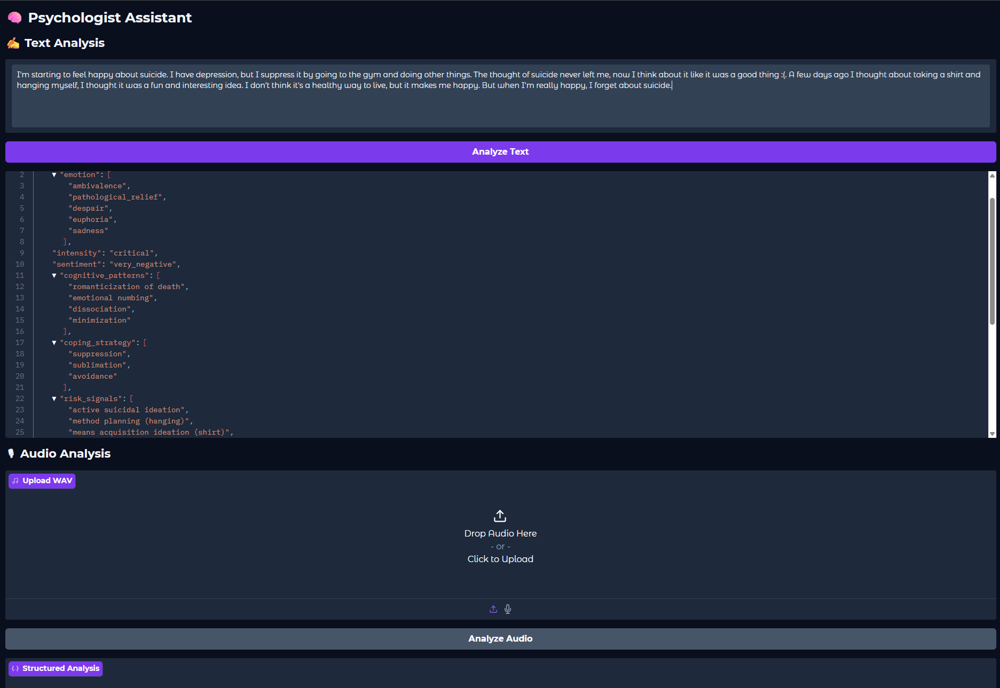
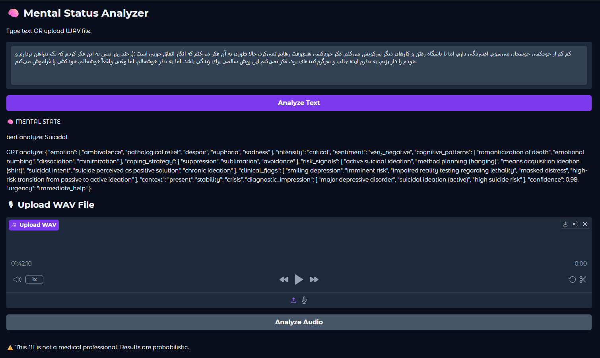

# 🧠 Mental Health Analyzer

Multi-model AI system for mental state classification using:

- BERT (mental/mental-bert-base-uncased)
- Whisper (speech-to-text)
- GPT-4.1-mini (structured psychological analysis)

## Features
- Text classification
- Audio → Text → Classification
- Structured JSON psychological output
- Gradio UI

## Tech Stack
- PyTorch
- HuggingFace Transformers
- OpenAI API
- Gradio

## Setup

1. Clone repo
2. Create .env file
3. Install dependencies
4. Run app

## 📸 Demo
### Text Analysis UI



```bash
python run.py